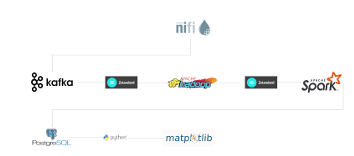
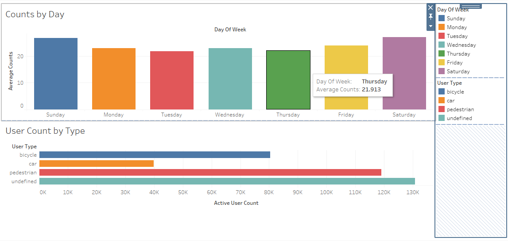
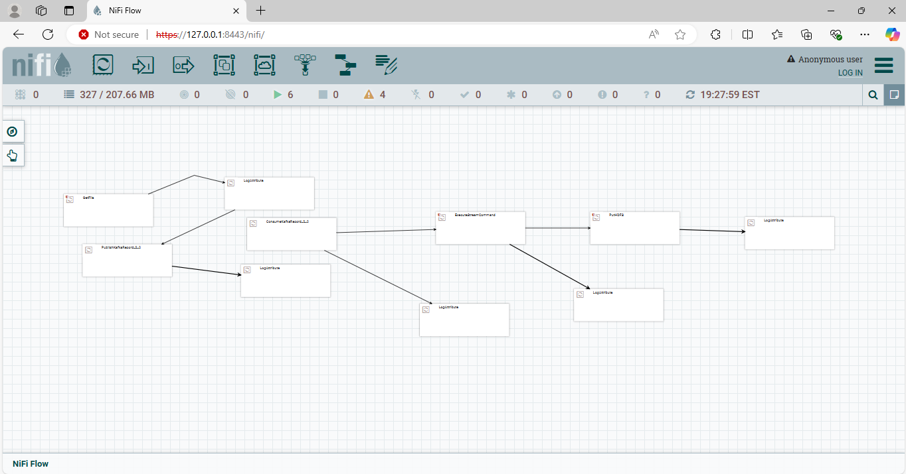
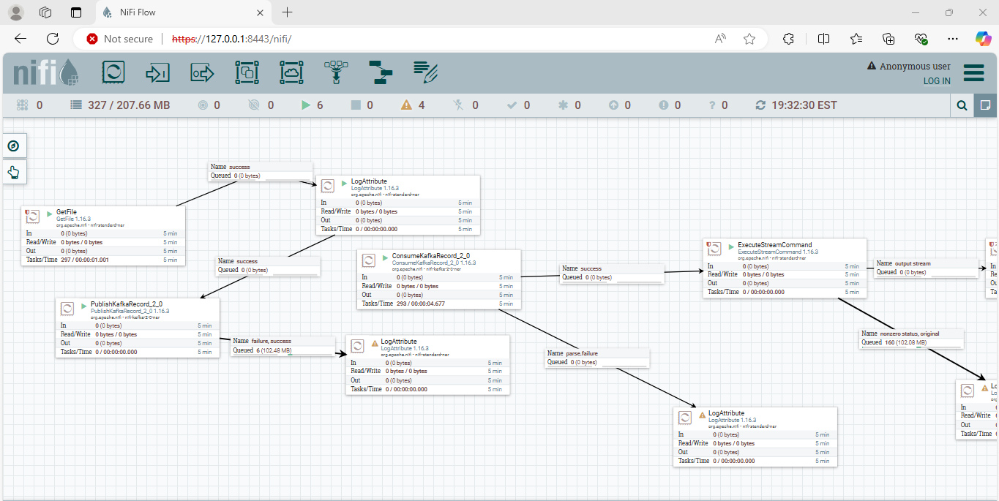
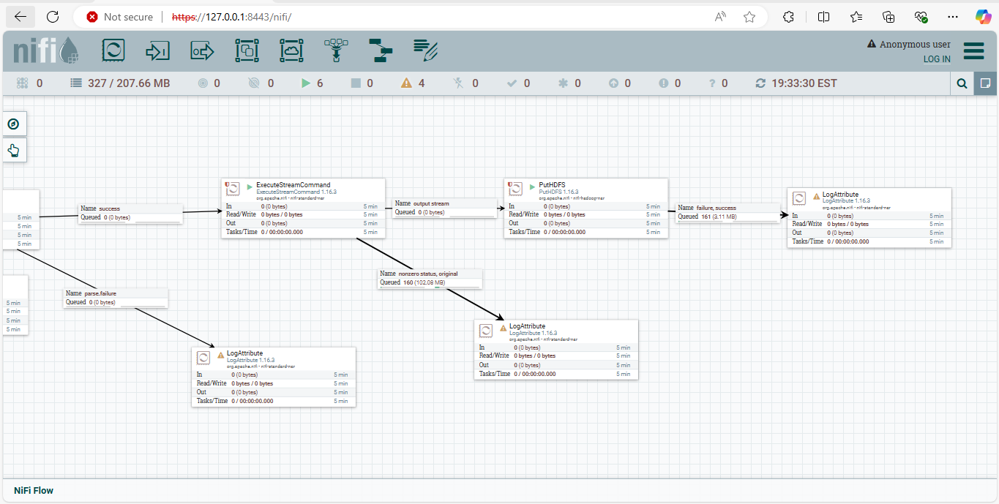

# Smart City IoT Data Pipeline

This project implements a Smart City architecture that manages and analyzes IoT data generated from various city sensors, such as traffic lights, air quality monitors, and energy meters. The pipeline supports scalable real-time data processing, storage, and visualization, leveraging technologies like Apache NiFi, Apache Kafka, Hadoop HDFS, Apache Spark, PostgreSQL, and Zstandard compression.

## Table of Contents

- [Overview](#overview)
- [Architecture](#architecture)
- [Technologies Used](#technologies-used)
- [Pipeline Components](#pipeline-components)
- [Setup Guide](#setup-guide)
- [Data Flow](#data-flow)
- [Data Compression with Zstandard](#data-compression-with-zstandard)
- [Usage](#usage)
- [Future Improvements](#future-improvements)

## Overview

As cities grow, managing resources and ensuring sustainable development become increasingly complex. Our Smart City IoT Data Pipeline handles large volumes of data from IoT sensors throughout the city to improve city services, optimize traffic, monitor environmental conditions, and enhance public safety.

## Architecture

The architecture supports a scalable, distributed pipeline for real-time data ingestion, processing, storage, and visualization:

1. **Data Ingestion**: Apache NiFi ingests data from IoT devices and processes it in real time.
2. **Message Queue**: Apache Kafka serves as the messaging layer for high-throughput data transfer.
3. **Data Storage**: Hadoop HDFS stores raw, compressed data, while PostgreSQL stores processed data for efficient querying.
4. **Data Processing**: Apache Spark performs batch processing and analytics on IoT data.
5. **Visualization**: Dashboards display metrics using tools like Grafana or Tableau.
6. **Compression**: Zstandard is used to compress data, reducing storage and bandwidth requirements.



## Technologies Used

- **Apache NiFi**: Automates data flow from IoT devices to Kafka.
- **Apache Kafka**: Handles high-throughput, low-latency data streams.
- **Hadoop HDFS**: Provides scalable storage for raw IoT data.
- **Apache Spark**: Processes and analyzes big data.
- **PostgreSQL**: Stores processed IoT data for structured querying and reporting.
- **Zstandard (ZSTD)**: Offers efficient compression for storage and transmission.
- **Visualization Tools**: Tableau for monitoring and insights.

## Pipeline Components

### Apache NiFi
- **Role**: Collects, processes, and routes IoT data.
- **Key Processors**:
  - `GetFile`: Retrieves IoT data from sensor files.
  - `PutKafka`: Sends processed data to Kafka topics.

### Apache Kafka
- **Role**: Acts as a distributed messaging layer for low-latency data transfer.
- **Topics**:
  - **Raw Data**: Stores unprocessed IoT sensor data.
  - **Processed Data**: Holds data after initial processing in NiFi.

### Hadoop HDFS
- **Role**: Stores raw IoT data in a distributed file system.
- **Compression**: Utilizes Zstandard to optimize storage space.

### Apache Spark
- **Role**: Performs data transformations and analytics.
- **Processing Types**:
  - **Batch Processing**: Scheduled jobs for data aggregation.
  - **Streaming**: Optional real-time processing.

### PostgreSQL
- **Role**: Stores processed IoT data for fast retrieval.
- **Schema**: Designed for querying data by sensor type, location, and timestamp.

### Visualization Tools
- **Role**: Provides dashboards to display city metrics.
- **Tools**: Tableau for real-time data visualization.

  

## Setup Guide

### Prerequisites
- Java 8 or higher
- Docker (optional, for containerized deployment)
- Zstandard CLI for compression testing
- PostgreSQL installed and configured

### Steps
1. Install Apache NiFi and configure data ingestion workflows.
2. Deploy Apache Kafka and set up topics for raw and processed data.
3. Install Hadoop and configure HDFS directories.
4. Set up Apache Spark for batch processing.
5. Install PostgreSQL and define schemas.
6. Enable Zstandard compression on data flows.
7. Configure dashboards for visualization.

## Data Flow

1. **Data Ingestion (NiFi)**: IoT data is ingested and sent to Kafka.
2. **Message Streaming (Kafka)**: Acts as a buffer for real-time data transfer to HDFS.
3. **Data Storage (HDFS)**: Kafka streams are stored, compressed using Zstandard.
4. **Data Processing (Spark)**: Reads data from HDFS, performs analytics, and sends results to PostgreSQL.
5. **Visualization**: Dashboards display metrics from PostgreSQL data.





## Data Compression with Zstandard

We use Zstandard (ZSTD) for data compression due to its high efficiency.

### Steps to Enable Zstandard:
1. Configure NiFi and HDFS to utilize `.zst` compression.
2. Adjust compression settings based on storage and latency needs.

## Usage

### Starting the Pipeline
1. Run NiFi to start data ingestion from IoT sources.
2. Start Kafka brokers and Spark jobs for processing.

### Running Spark Jobs
- Use Spark jobs to read from HDFS and transform data.
- Example command:
  ```bash
  spark-submit --class YourSparkJobClass --master yarn your-spark-application.jar
  ```

### Querying Data in PostgreSQL
- Use SQL commands or visualization tools to retrieve and display processed data.

## Future Improvements

1. **Real-time Analytics**: Integrate Spark Streaming for immediate data processing.
2. **Enhanced Visualization**: Add advanced dashboard features for better insights.
3. **Machine Learning**: Implement predictive analytics for smarter resource management.

---
